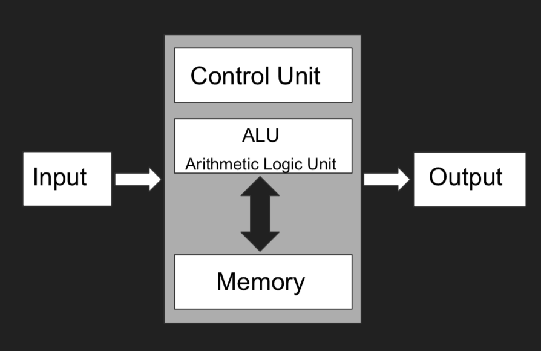

# Notes

---

# Basic Stuffs

### High level language

compiler interpret and translates the human readable instructions to machine operations

### Assembly language

lower level language that requires compiler to translate, but it is done one-to-one with machine operations

### Machine language

operations and their arguments represented in binary numbers and executed directly in hardware or by a microprogram embedded in the microprocessor

### von Neumann model

- a model of computation that is closely related to actual computer architecture
- similar to Turning machine model (imperative)

# JavaScript

### Basic commands

    const z = 1; // constant immutable variable
    
    function everything(x, y, n){
    	let t = x + y;    // let is mutable variable
    	t += z; // updating the t mutable variable
    	const result = t;
    	console.log("hello world");
    
    	return result;
    } 

### Loop

    function loop(n) {
    	sum = 0;
    	for (let i = 0; i <= n; i++) {
    		sum += i
    	}
    	return sum;
    }

### Recursion

    function sumTo(n) {
       if (n === 0) return 0;  // base case
       return n + sumTo(n-1);  // inductive step
    }
    
    function sumToOneLiner(n) {
       return n ? n + sumTo(n-1) : 0;
    }

### Arrays

    const tutors = ['tim', 'michael', 'yan', 'Yang', 'arthur', 'kelvin']
    tutors.length
    tutors[1]
    tutors[1] = 'mic'

    const obj = {
    	one: 123,
    	two: 456
    }
    obj.one = "hello" // objects are mutable

### Function Type

    // NAMED FUNCTION
    function hi(x){
    	return x;
    }
    
    // ANONYMOUS FUNCTION
    const hi = function(x){
    	return x;
    }
    
    // ARROW FUNCTION
    const hi = x => x

### Classes

    class Person {
       constructor(name, occupation) {
           this.name = name
           this.occupation = occupation
       }
       get greeting() {
    			// this refers to the instance of that class (refer to enclosing)
           return `Hi, my name's ${this.name} and I ${this.occupation}!`
       }
       sayHello() {
           console.log(this.greeting)
       }
    }
    
    const tim = new Person("Tim","lecture Programming Paradigms")
    tim.sayHello()
    >> Hi, my name's Tim and I lecture Programming Paradigms!

### Object-Oriented Polymorphism

    class LoudPerson extends Person {
        sayHello() {
            console.log(this.greeting.toUpperCase())
        }
    }
    
    const tims = [
        new Person("Tim","lecture Programming Paradigms"),
        new LoudPerson("Tim","shout about Programming Paradigms")
    ]
    
    tims.forEach(t => t.sayHello())
    >> Hi, my name's Tim and I lecture Programming Paradigms!
    >> HI, MY NAME'S TIM AND I SHOUT ABOUT PROGRAMMING PARADIGMS!

# FP Concepts

### Closure

A function that accesses a set of variables within an enclosing scope.

    function hello(x) {
    	value = 20 * x;
    	return y => value + y;	
    }

**Explanation**: Here "value" is the variable the returned function accesses and the enclosing scope is the function "hello". So, the returned function is a closure. 

### Arrow Notation

Writing in this: 

    function times(x){ 
    	return y => y * x;
    }

Is the same as writing in this:

    const times = x => y => y * x

### Higher-order Functions

A function that takes in other functions as parameters or returns another function.

    const hello = f => x => y => f(x, y)

### Currying

A function that takes multiple arguments but broken into a series of function that takes in one argument only (sequence of unary functions)

    const hello = f => x => y => f(x, y)
    const add = hello((x,y) => (x+y))(2)
    console.log(add(3)) // this returns 5
    console.log(add(10)) // this returns 12

E**xplanation**: "add" is a curried function because it takes in only one argument and performs computation based on its closure.

### Lazy Evaluation

Only call the function when necessary by delaying the execution of the function. 

**JavaScript**

    function silly(v: number) {
    	return () => silly(v+1)
    }
    
    const callSilly = silly(10)
    const call1 = callSilly() // returns 11
    const call2 = call1() // returns 12

**TypeScript**

    interface LazySequence<T> {
    	value: T,
    	next(): LazySequence<T>;
    }
    
    function naturalNumbers() : LazySequence<number> {
    	function _next(v: number) {
    		return {
    			value: v, 
    			next: () => _next(v+1)
    	}
    	return _next(1);
    }
    
    const n = naturalNumbers()
    n.value
    > 1
    const nNext = n.next()
    nNext.value
    > 2
    
    # only obtain the result when evaluated = lazy evaluation

### Fluent Interface (or Fluent Programming)

Make a function call chained in a fluent structure: a function returns a result, then call another function which upon also return another result

    const fluent = [1,2,3,4,5,6,7]
    	.filter(x => x > 4)
    	.map(x => 2 * x)

### Tail-Recursive

Tail recursive = the result of the function is the return value of the another function call (aka the recursive call is the last thing that this function performs, eg: does not perform any computation when returning)

Non-tail recursive = when returning, the function performs some computation along the way, so the result of the function ≠ the return value of the recursive call

**JavaScript**

**Tail recursive: pass the result into the recursive call to be returned in the recursive function**

    function tail(x, sum) {
        if (x === 0) { // strict evaluation of ===
            return sum;
        } else {
            return tail(x-1, sum+x);
        }
    }

**Non-tail recursive: set base cases condition, then perform recursive call with computations**

    function nonTail(x) {
        if (x === 0) {
            return x;
        } else {
            return x + nonTail(x-1);
        }
    }

**Haskell**

**Tail recursive: use "where" to declare smaller auxilary functions**

    fibonacci :: Integer -> Integer
    fibonacci n = fib_aux n 1 1
    	where
    		fib_aux 0 a b = a
    		fib_aux n a b = fib_aux n-1 b (a+b)
    
    fib_aux 3 1 1 
    fib_aux 2 1 2
    fib_aux 1 2 3
    fib_aux 0 3 5
    
    euler n = euler_aux n 0
    	where
    		euler_aux 0 sum = sum
    		euler_aux n sum = euler_aux (n-1) (sum + if n `mod` 3 == 0 || n `mod` 5 == 0 then n else 0)
    
    euler_aux 5 0 
    euler_aux 4 5
    euler_aux 3 5
    euler_aux 2 8
    euler_aux 1 8
    euler_aux 0 8 

**Non-tail recursive: perform pattern matching for base cases, then recursive call with computations**

    fibonacci :: Integer -> Integer
    fibonacci 0 = 1
    fibonacci 1 = 1
    fibonacci n = fibonacci (n-2) + fibonacci (n-1)
    
    fibonacci 3 = fibonacci 1 + fibonacci 2
                = fibonacci 1 + fibonacci 0 + fibonacci 1
    						= 1 + 1 + 1 
    						= 3

---

# TypeScript

### Basic Type Annotation

    let x = 1; // type number is inferred
    x = 'hello' // error cuz it is a string

### Type Function

    function operationOnTwoNumbers(f:(x:number, y:number)=>number) {
    	return function(x:number) {
    		return function(y:number) {
    				return f(x,y);
    		}
    	}
    }

### Type Aliases

Creating custom data type in TypeScript to allow it to reuse at multiple locations. 

    type BinaryFunction = (x: number, y: number) => number
    type CurriedFunction = (x: number) => (y: number) => number
    const operate: f: BinaryFunction => CurriedFunction 
    	= f => x => y => f(x, y)

**Explanation**: Takes in a BinaryFunction type and returns a CurriedFunction type.

### Generic Types

Using an unknown (usually represented as "T") to signify the data type - generalizing the type. 

    type BinaryFunction<T> = (x: T, y: T) => T
    type CurriedFunction<T> = (x: T) => (y: T) => T
    const operate: f: BinaryFunction => CurriedFunction 
    	= f => x => y => f(x, y)

**Explanation**: Here it takes in a general type T, can be any type. If T = number, then "number" is represented throughout the function of the character "T". Note that T can be any type, the type is generalized throughout the function.

### Cons List

    type ConsList<T> = Cons<T> | undefined
    type Cons<T> = (selector: Selector<T>) => T | ConsList<T>;
    type Selector<T> = (head: T, rest: ConsList<T>) => T | ConsList<T>;
    
    function cons<T> (head: T, rest: ConsList<T>): Cons<T> {
    	return (selector: Selector<T>) => selector(head, rest);
    }
    
    # pass in a selector function that selects the head
    function head<T>(list: Cons<T>):T {
    	return <T>list((head, rest) => head);
    }
    
    # pass in a selector function that selects the tail / rest
    function rest<T>(list: Cons<T>):ConsList<T> {
    	return <T>list((head, rest) => rest);
    }
    
    const aList = cons('Lists', cons("don't", cons("get",
       cons('any', cons('simpler',
       cons('than', cons('this')))))))
    
    const listToString: (l: ConsList<string>) => string 
    	= list => list? head(list) + " " + listToString(rest(list)) : " "
    
     
    # with combinators
    const I = x => x
    const K = x => y => x
    
    const cons = x => y => f => f(x)(y)
    const head = list => list(K)
    const tail = list => list(K(I))
    
    # reason
    K(I) = (x => y => x)(x => x)
    		 = (\x.\y.x) (\x.x)
    		 = (\y.\x.x)
    		 = (y => x => x)
    # it returns the second argument, as opposed to the first argument as what K does

---

# OO vs FP

[OO vs FP](https://www.notion.so/d8a18b36b2824416bfc408010d0fb38b)

# Functional Reactive Programming (FRP)

Using Observables to deal with streams of incoming data. 

### map

transform the items emitted by an Observable by applying a function to each item

### filter

emit only those items from an Observable that pass a predicate test

### takeUntil

discard any items emitted by an Observable after a second Observable emits an item or terminates

### flatMap

transform the items emitted by an Observable into Observables, then flatten the emissions from those into a single Observable

### subscribe

to officially make an event happen or operate upon the emissions and notifications from an Observable

---

# Lambda Calculus

### Introduction

a model of computation for functional programming

### I-Combinator

a function that takes in a value, and returns exactly the same value

**usages**:
- to wrap a value in a function that can be passed to other functions 
- for mocking in tests
- for extracting data from encapsulated types (e.g. by passing identity into map).

    ICombinator = λx.x
    ICombinator = x => x 

### K-Combinator

a function that takes in two arguments and ignores the second argument

    KCombinator = λxy.x
    KCombinator = x => y => x 

### Lambda Expression

    λ x.x
    const func = x => x // equivalent
    
    (λ x.x)y
    const func = (x => x)(y) // equivalent

**Explanation**: λ is the start of the function, followed by a list of parameters (taking in a value of x), then terminated with a "." and returns the x value.

### Alpha Equivalence

Expression could be renamed using different variables, but they still carry same meaning.

    λx y.x z = λa b.a c   
    /** here x = a, y = b and z = c, same meaning */
    
    λa b.a c = λu.λv.u w   
    /** here a = u, b = v, c = w, same meaning, 
    the second part is saying a function takes in a value, 
    then another function takes in another value
    which returns the first value and another free value */

### Beta Reduction

Substitute argument into a lambda expression

    (λx.xy) z
    = (λx[x := z].xy)
    = zy
    
    (λ param . output)input =>  output [param := input]  =>  result

### Beta Normal Form

a lambda expression that can't be reduced further

    λx.xx = λx.xx

### Divergence

a lambda expression that will reduce forever with no limit

    (λz.zz)(λy.yy)
    = λz[z := λy.yy].zz
    = (λy.yy) (λy.yy)
    = (λy.yy) (λy.yy)
    = (λy.yy) (λy.yy)

### Eta Conversion

Eliminate redundant lambda expression

    λx.f x = f  
    λx.M x = M
    // takes in a value and use this value as input for another function (f / M)
    // to remove redundancy, can just equate it to the function 

### Combinator

a lambda expression with no free variables (which are variables that are not bounded to any parameters)

    λx.xxx       // yes, no free variables
    λxy.zx       // no, free variable is z
    λxyz.xy(zx)  // yes, no free variables
    λxyz.xy(zxy) // yes, no free variables

### Reducing Lambda Expression

Expression reducing is left-associative, which is to reduce from left to right.

    (λz.z) (λa.a a) (λz.z b)
    = (λz[z := λa.a a].z) (λz.z b) // beta reduction
    = (λa.a a)(λz.z b)
    = (λa[a := λz.z b].a a) // beta reduction
    = (λz.z b) (λz.z b)
    = (λz[z := λz.z b].z b) // beta reduction
    = (λz.z b) b
    = (λz[z := b].z b) // beta reduction
    = b b
    
    (λxy.(λabc.abc) x (λuv.u) y) (λwz.z) (λwz.w)
    = λx[x := λwz.z] y[y := λwz.w] .(λabc.abc) x (λuv.u) y
    = (λabc.abc) λwz.z (λuv.u) λwz.w)
    = λa[a := λwz.z] b[b := λuv.u] c[c := λwz.w].abc
    = (λwz.z) (λuv.u) (λwz.w)
    = (λwz.w)

### Lamba Expressions in JavaScript, Haskell

    **Haskell: \x -> <expression>** 
    Example:
    map(\x -> x * x) [1,2,3,4,5]
    
    **JavaScript: x => <expression>**
    Example:
    [1,2,3,4,5].map(x => x * x)

### Y-Combinator

A function that calls itself again and again

    Y = λf. (λx. f (x x)) (λx. f (x x))
    Y g 
    = (λf. (λx. f (x x)) (λx. f (x x))) g
    = λf[f := g]. (λx. f (x x)) (λx. f (x x))
    = **(λx. g (x x)) (λx. g (x x))**
    = λx[x := λx. g (x x)]. g (x x)
    = g ((λx. g (x x)) (λx. g (x x))
    = g (λx[x := λx. g (x x)]. g (x x))
    = g (g (λx. g (x x) (λx. g (x x))
    = g (g (Y g))

# Haskell

### Typeclasses

using "derive" in a custom data type to allow different implementations (like "extends" in OOP and override them to create custom behaviour) — that's why it is called "typeclasses", a custom data type, that has classes behaviour (allow "extending")

    data Day = Mon | Tue | Wed | Thur | Fri | Sat | Sun
    	deriving (Eq, Show)
    
    -- custom data type derive a default "Show" to allow default behaviour of printing
    > print Mon
    Mon
    -- overridde the default Show to create custom type
    instance Show Day where
    	show Sat = "Sleep in"
    	show Sun = "Oh no it's nearly Monday"
    	show _ = "Sigh"
    > print Sat 
    "Sleep In"
    
    -- custom data type derive "Eq" to allow comparison among the data
    instance Eq Day where
    	Sat == Sat = True
    	Sun == Sun = True
    	_ == Sat = False
    	_ == Sun = False
    	Sat == _ = False 
    	Sun == _ = False
    	_ == _ = True
    
    > Sat == Sat 
    True

# Point-Free, Functors, Applicatives

## Point-Free

Rule to remember: (f . g) x = f (g x)

**Example 1:**

    aFunc a b c = (a+b) * c
    aFunc a b c = (*) (a+b) c     # change to prefix function
    aFunc a b = (*) (a+b)         # eta reduction, here we will receive one more parameter to be passed into multiplier
    aFunc a b = (*) (((+) a) b)   # change to prefix function, here ((+) a) is the g function and b is the x 
    aFunc a b = (*).((+) a) b     # using composition law
    aFunc a = (*).((+) a)         # perform eta reduction, here, (+) is g function and a is the x
    aFunc a = ((*).).(+) a 
    aFunc = ((*).).(+)            # here is takes two arguments to perform the RHS of (+) operator.

**Example 2:**

    func a b c = (a*b)+c
    func a b c = (+) (a*b) c   # operator sectioning - aka set prefix
    func a b = (+) (a*b)       # eta reduction
    func a b = (+) (((*) (a)) (b))    # operator sectioning
    func a b = (+).((*) (a)) b        # similar to f.g x
    func a = (+).((*) (a))            # eta reduction
    func a = ((+).).(*)               # eta reduction

**Example 3:**

    f a b = sqrt (a / b)
    f a b = sqrt ((/) a b)   # set operator prefix style
    f a b = sqrt (((/) a) b)    # f (g x), f = sqrt, g = ((/) a) and x = b, create precedence with brackets
    f a b = sqrt . ((/) a) b   # function composition with (.)
    f a = sqrt . ((/) a)   # eta reduction (remove b)
    f a = (sqrt .) . (/) a    # function composition with (.)
    f = (sqrt .) . (/)   # eta reduction (remove a)

**Example 4:**

    someF n = filter (<n)
    someF n = filter (n>)      # it takes in a number, then haskell will evaluate if "n is greater than <the number>"
    someF n = filter ((>) n)   # it is same meaning because (>) function will take in first value, which is (>) n 
    													 # (>) n will take in another number, haskell will "apply" the (>) function onto the first value, then second value
    someF n = filter . (>) n   # function composition
    someF = filter . (>)       # eta reduction

## Functors

**Purpose**: to apply a function to a contained value 
(value inside a container, apply function onto it)

**class Functor (f :: * -> *) where**
     **fmap :: (a → b) → f a → f b**

    > fmap (+3) (Just 2) -- same as (+3) <$> (Just 2)
    Just 5
    > fmap (+1) [1,2,3] -- [] is a container
    [2,3,4]
    > ((+3) <$>)) <$> [Just 0,Just 2,Nothing,Just 3] -- both [] and Just are containers, so 2 <$> (fmap) are used
    [Just 3,Just 5,Nothing,Just 6]

## Applicatives

**Purpose**: to apply a contained function to a contained value
(function inside a container + value inside a container)

**class Functor f => Applicative (f :: * -> *) where
      pure :: a → f a**        (to put a data into a container - for type safety)
     **(<*>) :: f (a -> b) -> f a -> f b**

    > Just (+3) <*> Just 2
    Just 5
    > [(*2), (+3)] <*> [1, 2, 3]
    [2, 4, 6, 4, 5, 6]
    > (+) <$> (Just 5) <*> (Just 3)
    Just 8
    > replicate <$> [1,2,3] <*> ['a','b','c'] 
    ["a","b","c","aa","bb","cc","aaa","bbb","ccc"]
    
    -- first puts the function f into the container for Applicative f
    -- then only perform applicative apply
    lift :: Applicative f => (a -> b -> c) -> f a -> f b -> f c
    lift f a b = (pure f) <*> a <*> b
    
    > lift (+) [1, 2, 3] [4, 5]
    [5,6,6,7,7,8]

## Important Differences

    f x          - apply function f onto x
    f $ x        - apply function f onto x
    f $ g x      - apply function f onto the result of function g (which applies to x)
    f <$> g x    - apply function f onto the x which is inside a Functor g
    f g <*> f x  - apply function g onto the x where both are inside an Applicative f

---

# Folding, Monoid, Traversables

## Folding

**Main purpose:** to return a "result" by combining elements together

**fold purpose:** to iterate through a list (or other container)
**foldMap purpose:** to map the function (returning a monoid) onto the data, then fold the list into a monoid (refer examples)

**class Foldable (t :: * -> *) where
      fold :: Monoid m => t m -> m
      foldMap :: Monoid m => (a -> m) -> t a -> m 
      foldr ::  (a -> b -> b) -> b -> t a -> b
      foldl :: (b -> a -> b) -> b -> t a -> b**

**Example**:

    foldr (-) 0 [1,2,3,4,5,6,7,8,9,10] -- start from right
    1-(2-(3-(4-(5-(6-(7-(8-(9-(10-0))))))))) 
    = -5 
    
    foldl (-) 0 [1,2,3,4,5,6,7,8,9,10] -- start from left
    0-1-2-3-4-5-6-7-8-9-10
    = -55
    
    -- it is called "foldMap" because:
    -- (1) map the function first, then
    -- (2) fold (combine) the returned result of the function 
    -- merge (fold) the mapped values: [2,3] ++ [4,6] ++ [6,9]
    foldMap (\x -> [2 * x, 3 * x]) [1, 2, 3]  
    = fold [[2,3],[4,6],[6,9]]    -- fold to combine all elements 
    = [2,3,4,6,6,9]
    
    -- merge (fold) the values: Sum 1 + Sum 2 + Sum 3 + Sum 4
    foldMap Sum [1,2,3,4] 
    = fold [Sum 1, Sum 2, Sum 3, Sum 4]   -- fold to combine all elements
    = Sum {getSum = 10}
    
    -- Tree is either empty, a leaf, or a node (have left subtree, right subtree and data)
    data Tree a = Empty | Leaf a | Node (Tree a) a (Tree a)
      deriving (Show)
    
    instance Foldable Tree where
    	foldMap :: Monoid m => (a -> m) -> Tree a -> m
    	foldMap _ Empty = mempty
    	foldMap f (Leaf x) = f x 
    	foldMap f (Node left x right) = mappend (foldMap left) $ mappend (f x) (foldMap right) 
    	-- pass the function onto x, then append the left result and data result, followed by the right result
    
    foldMap (:[]) (Node (Node (Leaf 1) 2 (Leaf 3)) 4 (Node (Leaf 5) 6 (Leaf 7)))
    = mappend [1,2,3] $ mappend [4] [5,6,7]
    = mappend [1,2,3] [4,5,6,7]
    = [1,2,3,4,5,6,7]

## Monoid

**Purpose**: to append things that can't be appended together (by creating custom typeclass)

**mappend purpose:** concatenate two containers
**mconcat purpose:** concatenate a list of containers

**class Monoid a where
      mempty :: a                            
      mappend :: a -> a -> a       
      mconcat :: [a] -> a**               

**Example**:

    -- normal appending
    > [1,2,3] ++ [4,5,6]
    [1,2,3,4,5,6]
    
    -- but does not work on custom data type like
    newtype Sum a = Sum { getSum :: a }
    
    -- so create custom typeclass for that data type
    instance Num n => Monoid (Sum n) where
      mempty = Sum 0
      mappend (Sum x) (Sum y) = Sum (x + y)
    
    -- to have the same behaviour and effect as ++
    > mappend (Sum 3) (Sum 4)
    Sum {getSum = 7}
    
    > mconcat [Sum 1, Sum 2, Sum 3, Sum 4]
    Sum {getSum = 10}
    
    > mappend [1,2,3] [4,5]
    [1,2,3,4,5]
    
    > mappend "Testing " "String "
    "Testing String "
    
    > mconcat [[1],[2],[3]]
    [1,2,3]
    
    > mconcat ["Testing ", "String "]
    "Testing String "

## Traversables

**Main purpose:** to iterate entire container, and apply Applicative effect onto the container

**traverse purpose:** map a function onto the container, then create a sequence from it
**sequenceA purpose:** go through the container in a "sequential order", then apply applicative onto it  - aka "sequence-Applicative" which is "sequenceA"

**class (Functor t, Foldable t) => Traversable (t :: * -> *) where
      traverse :: Applicative f => (a -> f b) -> t a -> f (t b)
      sequenceA :: Applicative f => t (f a) -> f (t a)**

**Example**:

    -- traverse:
    traverse :: Applicative f => (a -> f b) -> [a] -> f ([b])
    traverse f list = sequenceA $ map f list
    
    > traverse (\x -> Just (x + 1)) [0..4]
    Just [1,2,3,4,5]
    > traverse (\x -> if x <0 then Nothing else Just x) [1,2,-3,4,5]
    Nothing
    
    -- sequenceA:
    lift :: Applicative f => (a -> b -> c) -> f a -> f b -> f c
    lift f a b = (pure f) <*> a <*> b
    
    sequenceA :: Applicative f => [f a] -> f [a]
    sequenceA list = foldr (lift (:)) (pure []) list
    
    > sequenceA [Just 3, Just 2, Just 4]
    Just [3,2,4]
    > sequenceA [Just 3, Just 2, Nothing]
    Nothing
    > sequenceA [(+3),(*2),(+6)] 2
    [5,4,8]
    
    -- Tree is either empty, a leaf, or a node (have left subtree, right subtree and data)
    data Tree a = Empty | Leaf a | Node (Tree a) a (Tree a)
      deriving (Show, Traversable)
    
    instance Traversable Tree where
    	traverse :: Applicative f => (a -> f b) -> Tree a -> f (Tree b)
    	traverse _ Empty = pure Empty -- to satisfy type
    	traverse f (Leaf a) = Leaf <$> f a -- apply the function, then put back the original container
    	traverse f (Node left x right) = Node <$> mappend (traverse f left) $ mappend (f x) (traverse f right)
    
    > traverse print t
    1
    2
    3
    4
    5
    6
    7

---

# File IO, Monads

## File IO

**Purpose**: to get data from user input which assigns to some variable, as haskell does not have variables assignment, Monad and IO deals with user input

**Function type:**
getLine :: IO String
putStrLn :: String -> IO ()
readFile :: FilePath -> IO String

**Example**:

    greet :: String -> IO ()
    greet name = putStrLn ("Nice to meet you, " ++ name ++ ".")
    
    > greet "Woofie Dog"
    "Nice to meet you, Woofie Dog." -- a way to get the input, then print the user input
    
    meetAndGreet2 :: IO ()
    meetAndGreet2 = do 
      putStrLn "Hi, what's ur name?"   -- first prints a statement 
      name <- getLine      -- then get the IO string from user
      greet name      -- and pass the string as input to greet

## Monads

**Purpose**: to apply a function that returns a contained value to a contained value (takes in a contained value, then apply a function that returns a contained value onto this)

**join purpose**: to "squash" elements in a container together (aka to remove the outer container)

**class Applicative m => Monad (m :: * -> *) where
      (>>=) :: m a -> (a -> m b) -> m b     *"bindright"*
      (=<<) :: (a -> m b) -> m a -> m b     *"bindleft"*
      join :: m (m a) -> m a** 

    pure :: Applicative f => a -> f a
    
    > pure . (+1) <<= [1..9] -- or [1..9] >>= pure . (+1)
    [2,3,4,5,6,7,8,9,10]
    -- (+1) takes in a number, then return the computed value
    -- pure takes in something, and put that "something" into a container
    -- pure . (+1) means takes in a number, which is passed to (+1) to compute the value, 
    -- then pass this computed value into pure to return a contained value
    
    half :: Integral a => a -> Maybe a
    half x = if even x then Just (x `div` 2) else Nothing
    
    > Just 3 >>= half
    Nothing
    > Just 4 >>= half
    Just 2
    
    -- squashing elements / removing the outer container
    > join [[1, 2, 3], [1, 2]]
    [1,2,3,1,2]
    > join (Just (Just 7))
    > Just 7

---

# Dynamic Data Structures

    -- a binary tree with left and right subtree (where these subtrees could be Nil)
    data BinTree a = Node a (BinTree a) (BinTree a) | Nil
    
    -- return the value associated with that integer by searching in the binary search tree
    search :: BinTree (Integer, a) -> Integer -> Maybe a
    search Nil _ = Nothing
    search (Node (key, value) left right) query
      | query < key = search left query
      | query > key = search right query
      | otherwise = Just value
    
    -- in order traversal that converts the tree to an array
    binTreeToArray :: BinTree a -> [a]
    binTreeToArray Nil = []
    binTreeToArray (Node value left right) = binTreeToArray left ++ [value] ++ binTreeToArray right
    
    instance Foldable BinTree where
      foldMap _ Nil = mempty
      foldMap f (Node value left right) = mconcat [foldMap f left, f value, foldMap f right]
    
    instance Traversable BinTree where
        traverse _ Nil = pure Nil
        traverse f (Node l v r) = Node <$> traverse f l <*> f v <*> traverse f r
    
    -- | Replacing elements -> changing from immutable behaviour (of haskell) to mutable 
    -- mutable means calling a recursive function to re-construct a new data / object to mutate it
    -- >>> display $ replace t 11 'a'
    -- Just "Yummy pineapple"
    -- >>> display $ replace t 8 'o'
    -- Just "Yummy poneupple"
    replace :: LookupTree a -> Integer -> a -> LookupTree a
    replace Nil _ _ = Nil
    replace (Node l (k,v) r) q c
      | q < k = Node (replace l q c) (k,v) r
      | q > k = Node l (k,v) (replace r q c)
      | otherwise = Node l (q,c) r
    
    t :: BinTree (Integer, Char)
    t = Node (8, 'i') 
          ( Node (4, 'm') 
            ( Node (2,'u') (Node (1,'y') Nil Nil) (Node (3,'m') Nil Nil) ) 
            ( Node (6,'k') (Node (5,'y') Nil Nil) (Node (7,'p') Nil Nil) )
          ) 
          ( Node (12, 'p') 
            ( Node (10,'e') (Node (9,'n') Nil Nil) (Node (11,'u') Nil Nil) )
            ( Node (6,' ') (Node (13,'p') Nil Nil) (Node (15,'e') Nil Nil) )
          )

---

# Constraint Programming

→ **Functional (FP)** talks about **what to do** through what functions should do
→ **Imperative (IP)** talks about **how to do** through series of steps to execute
→ **Constraint (CP)** talks about the **properties of the solution** (what's the characteristics of the solution/output) and mostly used in AI or fields that deal with large-scale combinations (eg: AI predict by branching trees massively)

Note: "%" is a comment in MiniZinc

## MiniZinc Modelling

### Map Colouring

**Description**: Minimize the number of colours used to mark different territories

    >> INPUT << 
    % parameter (number of colours)
    int: nc = 7;  // a total of 7 colors used
    
    % variables mapping states to colours
    var 1..nc: wa;  // 1 color for "wa" state
    var 1..nc: nt;  // 1 color for "nt" state
    var 1..nc: sa;  
    var 1..nc: q;
    var 1..nc: nsw; 
    var 1..nc: v;
    var 1..nc: t;
    
    >> OUTPUT << 
    wa = 1;
    nt = 1;
    sa = 1;
    q = 1;
    nsw = 1;
    v = 1;
    t = 1;

**Explanation**: 
Each number is considered as "one state" and the output gave us all states with same color (same number) because there isn't any constraints that tells the code what are the states that should be colored differently. So all states ended up being colored with the same color.

**Purpose of CP (Contraint Programming)**: Set contraints to the properties of the output so that we can have a **set of rules to define the output**

**Example with constraints set:**

    >> INPUT <<
    % parameter (number of colours)
    int: nc = 7;
    
    % variables mapping states to colours
    var 1..nc: wa; 
    var 1..nc: nt;
    var 1..nc: sa; 
    var 1..nc: q;
    var 1..nc: nsw; 
    var 1..nc: v;
    var 1..nc: t;
    
    >> SETTING CONTRAINTS TO AVOID STATES HAVING THE SAME COLOR << 
    % adjacent states have different
    % colours
    constraint wa != nt;
    constraint wa != sa;
    constraint nt != sa;
    constraint nt != q;
    constraint sa != q;
    constraint sa != nsw;
    constraint sa != v; 
    constraint q != nsw;
    constraint nsw != v;
    
    % set the total number of colours
    var 1..nc: n_colours;
    
    % this guarantees that minimal colours are used to colour all states
    constraint n_colours = max([wa,nt,sa,q,nsw,v,t]);
    
    % minimize the total number of colours used
    solve minimize n_colours;
    
    >> OUTPUT <<
    wa = 3;
    nt = 2;
    sa = 1;
    q = 3;
    nsw = 2;
    v = 3;
    t = 1;
    n_colours = 3;

**Explanation**:
The constraints are set, allowing the output to have certain rules (such that the ouptut will always use the minimal number of colors to color all states). Here, the output shows only 3 colors are used to fulfill the output requirements (constraints). 

### Puzzle Exercise

**Description**: Let / map each character to a digit number. Given "THIS", "IS", and "EASY", map each digit in the string to a number in between 0-9 such that the first character cannot be the digit 0. For instance, "T", "I", "E" cannot be 0, and "H", "I", S", ... each unique character must be mapped to unique numbers (i.e: same character ≠ same digit)

    >> INPUT FOR UNIQUE CHARACTERS ONLY <<
    var 1..9: T;  # 1st character ≠ 0
    var 0..9: H;  # subsequent characters can be any 1-9
    var 1..9: I;  # 1st character ≠ 0
    var 0..9: S;  # subsequent characters can be any 1-9
    var 1..9: E;  # 1st character ≠ 0
    var 0..9: A;  # subsequent characters can be any 1-9
    var 0..9: Y;  # subsequent characters can be any 1-9
    
    >> SET CONSTRAINTS SO THAT EACH CHARACTER CAN'T HAVE SAME DIGIT << 
    constraint T≠H /\ T≠I /\ T≠S /\ T≠E /\ T≠A /\ T≠Y    # brute force combinations to let T can't be same as all other characters
                   /\ H≠I /\ H≠S /\ H≠E /\ H≠A /\ H≠Y    # brute force combinations to let H can't be same as all other characters
                          /\ I≠S /\ I≠E /\ I≠A /\ I≠Y
                                 /\ S≠E /\ S≠A /\ S≠Y
                                        /\ E≠A /\ E≠Y
                                               /\ A≠Y;
    
    >> NOT SO IMPORTANT CONSTRAINTS, USELESS STUFF IMO << 
    constraint 1000 * T + 100 * H + 10 * I + S
                                  + 10 * I + S
             = 1000 * E + 100 * A + 10 * S + Y;
    
    >> OUTPUT << 
    T = 1;
    H = 9;
    I = 7;
    S = 4;
    E = 2;
    A = 0;
    Y = 8;

**Explanation**: 
The output shows each character mapped to a different digit, at the same time, fulfilling the output requirements (constraints, like first char ≠ 0). 

### Another Puzzle Exercise

**Description**: Same as the puzzle exercise above, but with a variable. Now with strings "SEND" + "MOST" = "MONEY", map each character to different digit with no first character with digit 0. 

    >> INPUT << 
    % SEND + MOST = MONEY
    % UNIQUE CHARACTERS = S,E,N,D,M,O,T,Y
    
    var 1..9: S;
    var 0..9: E;
    var 0..9: N;
    var 0..9: D;
    var 1..9: M;
    var 0..9: O;
    var 0..9: T;
    var 0..9: Y;
    
    constraint S!=E /\ S!=N /\ S!=D /\ S!=M /\ S!=O /\ S!=T /\ S!=Y 
                    /\ E!=N /\ E!=D /\ E!=M /\ E!=O /\ E!=T /\ E!=Y 
                       		  /\ N!=D /\ N!=M /\ N!=O /\ N!=T /\ N!=Y 
                      			  	    /\ D!=M /\ D!=O /\ D!=T /\ D!=Y 
    	              								       	/\ M!=O /\ M!=T /\ M!=Y 
    	              								       			 	  /\ O!=T /\ O!=Y 
    	              																        /\ T!=Y;
    
    constraint 1000 * S + 100 * E + 10 * N + D
             + 1000 * M + 100 * O + 10 * S + T
             = 10000 * M + 1000 * O + 100 * N + 10 * E + Y;
    
    >> DEFINE NEW INT VARIABLE MONEY <<
    var int: money;
    
    >> SET THE CONTRAINT FOR THIS VARIABLE, BASICALLY A FORMULA TO 
    CONVERT THE DIGITS TO A NUBMER, NOT SO IMPORTANT <<
    constraint money = 10000 * M + 1000 * O + 100 * N + 10 * E + Y;
    
    >> TO OBTAIN THE MAXIMIMUM MONEY, IF "maximize" IS USED, 
    PROGRAM WILL SEARCH FOR THE MAXIMUM FOR: "M", "O", "N", "E", "Y", 
    TO OBTAIN THE MAXIMUM VALUE <<
    solve maximize money;
    
    >>> IF "minimize" IS USED, 
    PROGRAM WILL SEARCH FOR THE MINIMUM VALUE FOR: "M", "O", "N", "E", "Y", 
    TO OBTAIN THE MINIMUM VALUE <<
    
    >> OUTPUT << 
    S = 9;
    E = 7;
    N = 8;
    D = 4;
    M = 1;
    O = 0;
    T = 2;
    Y = 6;
    money = 10876;

**Explanation:** 
The output shows the maximum value that is obtainable where it follows the requirements given (constraints, like different character = different digit)

### Baking Cakes

**Description**: Maximize the profits for making cakes, based on the available ingredients.

    /*
     Problem description:
     We have 4kg of flour, 6 bananas, 2kg of sugar, 500g of butter and 500g of cocoa.
    
      Banana cake:
      250g   self-raising flour
      2      mashed bananas
      75g    sugar
      100g   butter
    
      Chocolate cake:
      200g   self-raising flour
      75g    cocoa
      150g   sugar
      150g   butter  
    
     Banana cakes sell for $4.00, chocolate cakes for $4.50
     Determine how many of each sort of cake we should make to maximise profit.
    */
    
    % Variables express how many cakes to bake of each type
    var 0..5: b; % b to represent banana
    var 0..5: c; % c to represent cocoa 
    
    % set the constraints so that banana and chocolate cake will not use more than the available ingredients
    constraint 250*b + 200*c <= 4000;
    constraint 2*b + 0*c <= 6;
    constraint 75*b + 150*c <= 2000;
    constraint 100*b + 150*c <= 500;
    constraint 0*b + 75*c <= 500;
    
    % set the formula for the profit, then ask minizinc to get the maximum profit based that fulfill the contraints
    var float: profit = 4.0*b + 4.5*c;
    solve maximize profit;
    
    % Output solution, not important, ignore
    output ["b= ",show(b),", c=",show(c),", profit=",show(profit),"\n"];
    
    >> OUTPUT << 
    b= 2, c=2, profit=17.0

**Explanation**: 
The contraints are set. Then ask MiniZinc to search for the maximum obtainable profit. MiniZinc then brute force every single possible combination, and find out which combination will give the highest profit. 

The output shows that baking 2 banana cake and 2 chocolate cake will yield profit of $17. This maximum profit is based on the contraints (for example, it maximizes all the ingredients and check which one is better to make, banana or chocolate cake to get higher profit). 

### N-Queens

**Description**: Set contraints to fulfill the requirement of N-Queen:
1) queens cannot be on same row
2) cannot be on same column
3) cannot be on same diagonal

← **Determine diagonal**

    % Variable for the number of queens
    int: n;
    
    % An array to store the position of queen, where q[i] represent the column of queen i
    % if array is [1,2,3,4,5], then queen 0 is located column 1, queen 1 located at column 2, queen 2 located column 3....
    array[1..n] of var 1..n: q;
    
    % set contraint i != j to avoid queens on same row 
    % set contraint q[i] != q[j] to avoid queens on same column
    constraint forall (i, j in 1..n where i != j) (q[i] != q[j]);
    
    % set constraint i + q[i] != j + q[j] to avoid queens on the same diagonal
    % it is + because the determination of diagonal is could be based on row+column, 
    % like row 2 column 2 = 4, row 1 column 3 = 4, row 3 column 1 = 4, all these "4" are located at same diagonal
    constraint forall (i, j in 1..n where i != j) (
      i + q[i] != j + q[j]
    );
    constraint forall (i, j in 1..n where i != j) (
      i - q[i] != j - q[j]
    );

**Explantion**: MiniZinc just brute forces every possible outcome and check if the requirements are fulfilled. 

### Stable Marriage Problem

**Description**: Maximize the happiness of stable marriages by brute forcing all possible relationship happiness

    /*
     Problem description:
    
     There are n (straight) men and n (straight) women.
     Each man has a ranked list of women and vice versa.
     A LOWER NUMBER IN THE RANK MEANS A HIGHER PREFERENCE!
     We want to find a husband/wife for each woman/man such that all marriages are stable:
      - if m prefers another woman o to his wife w, then o prefers her husband to m
      - if w prefers another man o to her husband h, then o prefers his wife to w
    */
    
    % Parameters
    
    enum Men;
    enum Women; 
    
    % rankWomen[i,j] is the rank that woman i assigns to man j
    array[Women, Men] of int: rankWomen;
    % rankMen[i,j] is the rank that man i assigns to woman j
    array[Men, Women] of int: rankMen;
    
    % Variables
    
    % Map each man to his wife
    array[Men] of var Women: wife ::add_to_output;
    % Map each woman to her husband
    array[Women] of var Men: husband ::add_to_output;
    
    % TODO: constraints that link the wife/husband assignments
    constraint forall (m in Men) (husband[wife[m]] == m);
    constraint forall (w in Women) (wife[husband[w]] == w);
    
    /* TODO: the preference constraints
        for each man m and woman w,
         - if m prefers another woman w to his wife,
           then w prefers her husband to m
    */
    constraint forall (m in Men, w in Women) (
      if husband[w] !=m /\ rankWomen[w,m] < rankWomen[w, husband[w]]
      then rankMen[m,w] > rankMen[m, wife[m]]
      endif
    );
    
    var int: happiness = sum(m in Men) (rankMen[m, wife[m]]) 
                    + sum(w in Women) (rankWomen[w, husband[w]]);
                    
    
    solve maximize happiness;
    output ["happiness=",show(happiness),"\n"];

## How MiniZinc Operates

MiniZinc choose the maximum or minimum, based on tree search, simulate all possibilities, and then choose the best outcome (basically brute force AI)

[Notes/Screen_Recording_2019-11-10_at_4.06.10_PM.mov](Notes/Screen_Recording_2019-11-10_at_4.06.10_PM.mov)

## Important MiniZinc Syntax

    >> VARIABLES <<
    int: i = 3; (variable declaration + assignment)
    var int: i; (variable declaration)
    i = 12345; (variable assignment)
    bool flag: true;
    
    >> FILE INCLUSION << 
    include "file.mzn" (something like import in Python)
    
    >> SOLVING << 
    solve satisfy
    solve minimize abc (where abc is a formula that performs arithmetic computation like 1+2+3)
    solve maximize abc (where abc is a formula that performs arithmetic computation like 1+2+3)
    
    >> OPERATIONS << 
    = 
    != 
    > 
    < 
    >= 
    <=
    /\ (represent and &&)
    \/ (represent or ||)
    -> 
    <- 
    <-> 
    not (not true will become false)
    
    operations:
    product 
    sum
    max
    min
    
    formula:
    contraint
    	forall (i in 1..10) (
    		<variable> = <operation> <loop> <array[i, j]>

    % sum to the same value:
    var int: rowsum;
    contraint forall (i in PuzzleRange) (
    	rowsum = sum (j in PuzzleRange)(puzzle[i, j])
    );
    
    constraint forall (j in PuzzleRange) (
    ​ ​alldifferent( [ puzzle[i,j] | i in PuzzleRange ​] ) )​;